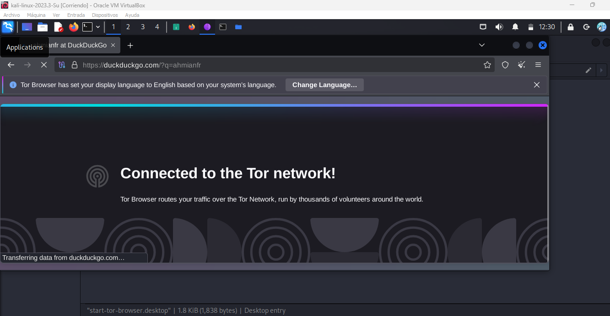
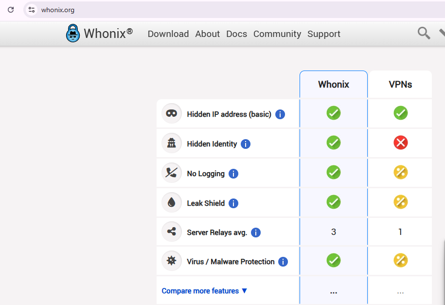

# DarkWeb
🔒 Anonimato en la Dark Web: Tor, Kali Linux y Whonix 🔒

Intro a la dark web 👉 : https://lnkd.in/dHWJXDsm

Hoy en día, la privacidad y el anonimato en línea son clave para cualquier profesional de la ciberseguridad. 

Si estás explorando la Dark Web o simplemente quieres mejorar tu seguridad, aquí te dejo algunos consejos sobre cómo hacerlo de forma más segura.

✅ Opción 1: Tor en Kali Linux (o cualquier Linux)
Yo prefiero usar Tor en Linux dentro de una máquina virtual (VM), ya que así puedes mantener todo más aislado y eliminar rastros. En la VM, puedes usar un buscador como Ahmia o alguno similar para navegar por la Dark Web. En mi caso, utilizo Kali Linux para este tipo de actividades.

✅ Opción 2: Whonix (Mayor seguridad)
Para casos más avanzados, una opción aún más segura sería usar las máquinas de Whonix, que fuerza todo el tráfico a través de Tor de forma estricta usando su propio Whonix-Gateway.

🔹 Whonix-Gateway: Maneja todo el tráfico a través de Tor.

🔹 Whonix-Workstation: Se conecta únicamente a través del Gateway, evitando fugas de IP.

📌 En las imágenes muestro:

👉 Kali Linux conectado a Tor.

👉 Una comparación entre Whonix y las VPNs en términos de privacidad y seguridad en línea. 

